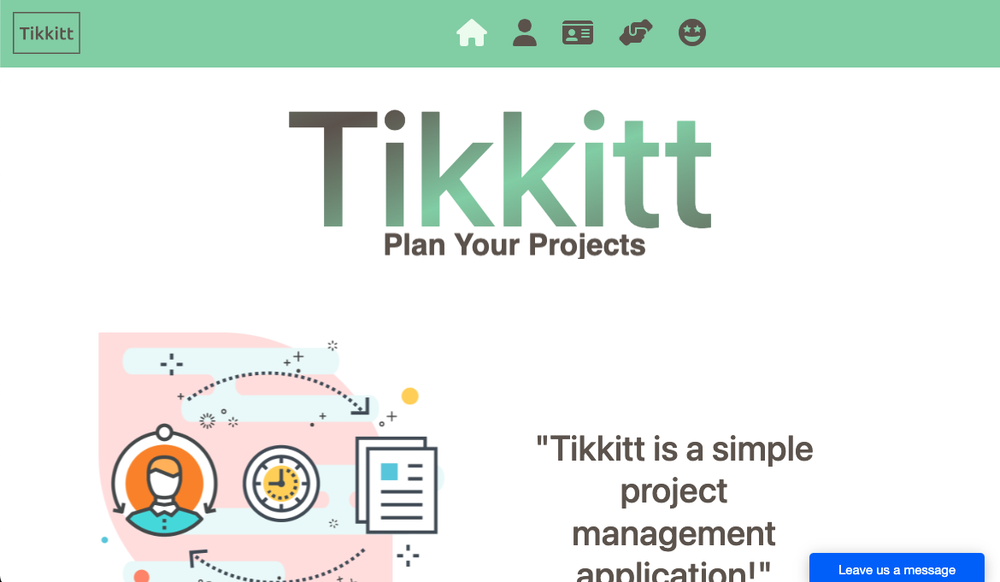
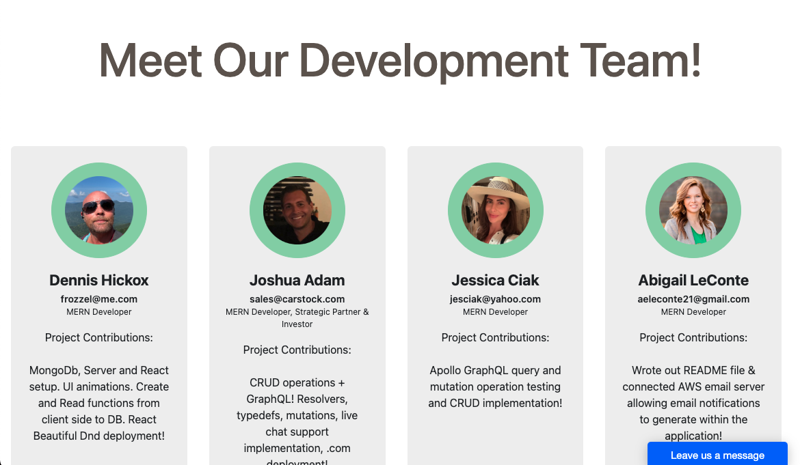

<div>
<a href=""></a></div>


---

# Tikkitt

Project Managment App for allowing Tikkitt's to be assigned to team members and then completed in a timely manner. 

## Description

Tikkett is an American cloud-based software company headquartered in Atlanta, GA. It provides customer relationship management (CRM) service and also provides enterprise applications focused on customer service, marketing automation, analytics, and application development.

## Table of Contents
1. [Description](#description)
2. [Dependancie](#dependancies)
3. [Installation](#installation)
4. [Authors](#authors-/-web-developers)
5. [License](#license)
6. [Acknowledgements](#acknowledgements)


## Getting Started

 [Vist Our Site](https://tikkitt.herokuapp.com/)





### Dependancies
To run this application, you'll need to run the following commands:
<!-- Let me know what else is needed to run this app -->

```
npm i
npm run seed
npm run develop
````


## Authors / Web Developers

* Dennis Hickox - [GitHub](https://github.com/frozzel)
* Jessica Ciak - [GitHub](https://github.com/jesciak)
* Josh Adam - [GitHub](https://github.com/meloard)
* Abigail LeConte - [GitHub](https://github.com/AbigailLeConte)


## License


This project is licensed under the EULA License - see the LICENSE.md file for details

## Acknowledgments

Inspiration, code snippets, etc.
* [Tikkett](https://www.Tikkett.com/)
* [Bootstrap](https://react-bootstrap.github.io/getting-started/introduction)
* [Colorhunt Palette](https://colorhunt.co/palette/effcefccedd294d3ac655c56)
* [Alvarotrigo](https://alvarotrigo.com/blog/css-text-animations/)
* [Slider Revolution](https://www.sliderrevolution.com/resources/css-text-animation/)
* [PNG Tree](https://pngtree.com/so/project-managment)
* [Free Frontend](https://freefrontend.com/bootstrap-profiles/)


